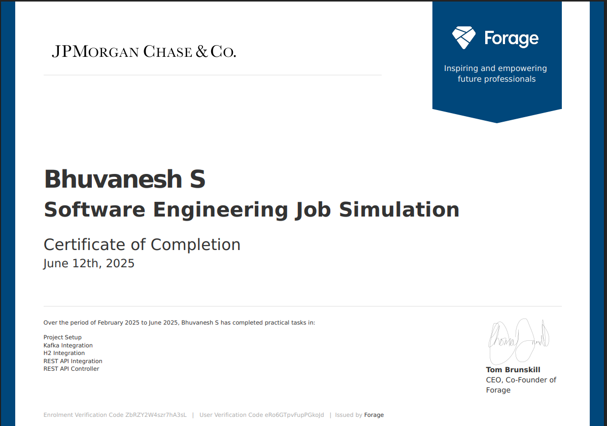
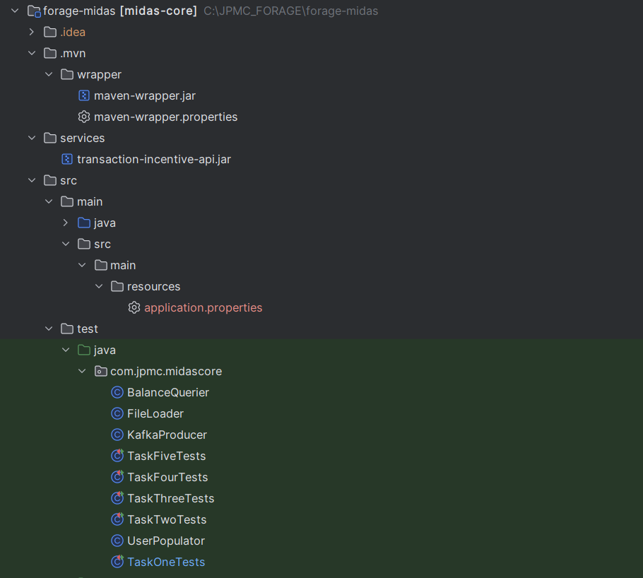

# JPMorgan Chase Forage Job Simulation – Midas Core Backend

This repository contains the solution to the **JPMorgan Chase Software Engineering Virtual Experience Program** on Forage. The project simulates a core part of a banking system — the **Midas Core backend** — which processes and stores user financial transactions with real-time incentive logic via Kafka and external APIs.

---
## My Certificate 



## 💼 About the Project

The **Midas Core** system is a backend Spring Boot application that:
- Receives transaction messages via **Kafka**
- Applies incentives via an external incentive service
- Stores users and transactions in a **relational database**
- Exposes a REST API to check user balances

This simulation provides experience with real-world technologies used at JPMorgan Chase & Co., including microservices, messaging systems, automated testing, and external service integration.

---

## 🧰 Tech Stack

| Category         | Tools/Technologies                               |
|------------------|--------------------------------------------------|
| Language         | Java 17                                          |
| Framework        | Spring Boot                                      |
| Messaging        | Apache Kafka                                     |
| Testing          | JUnit, Spring Boot Test                          |
| Build Tool       | Maven                                            |
| External Service | `transaction-incentive-api.jar` (provided by JPMC) |
| DB/ORM           | H2 (In-Memory DB), JPA (Hibernate)               |
| JSON             | Jackson                                          |

---

## 📁 Project Structure


---
## EXPLANATION OF ALL THE 5 TASKS 

## TASK 1
### Environment Setup & Project Foundation
## Objective
Set up local development environment, analyze existing codebase scaffold, and integrate required dependencies for the Midas Core system.
## Technologies Integrated

Spring Boot 3.2.5 - Application framework and auto-configuration
Apache Kafka 3.1.4 - Message streaming for transaction ingestion
Spring Data JPA 3.2.5 - Database persistence layer
H2 Database 2.2.224 - In-memory database for development
Maven - Build management and dependency resolution
Java 17 - Modern JDK with enhanced features
Testcontainers 1.19.1 - Integration testing framework

## Implementation Steps Completed
### 1. Repository Setup
bash# Forked and cloned the project repository
git clone https://github.com/vagabond-systems/forage-midas
cd forage-midas
### 2. Development Environment Configuration

IDE: IntelliJ IDEA configured with Spring Boot support
JDK: Java 17 runtime environment setup
Maven: Project structure and build lifecycle configured

### 3. Dependency Integration
Successfully add all required dependencies  INSIDE <dependencies> section to pom.xml:
```bash
xml<dependencies>
    <!-- Spring Boot Web & JPA Starters -->
    <dependency>
        <groupId>org.springframework.boot</groupId>
        <artifactId>spring-boot-starter-web</artifactId>
        <version>3.2.5</version>
    </dependency>
    <dependency>
        <groupId>org.springframework.boot</groupId>
        <artifactId>spring-boot-starter-data-jpa</artifactId>
        <version>3.2.5</version>
    </dependency>
    
    <!-- Kafka Integration -->
    <dependency>
        <groupId>org.springframework.kafka</groupId>
        <artifactId>spring-kafka</artifactId>
        <version>3.1.4</version>
    </dependency>
    
    <!-- Database & Testing -->
    <dependency>
        <groupId>com.h2database</groupId>
        <artifactId>h2</artifactId>
        <version>2.2.224</version>
    </dependency>
    <dependency>
        <groupId>org.testcontainers</groupId>
        <artifactId>kafka</artifactId>
        <version>1.19.1</version>
        <scope>test</scope>
    </dependency>
</dependencies>
```

### 4. Codebase Analysis

Reviewed existing Spring Boot application scaffold
Identified core packages: controllers, services, repositories
Analyzed configuration files and application structure
Understood integration points for external dependencies

## Task Execution Results
### Test Execution
### Successfully executed TaskOneTests with all dependencies properly configured.
## Output Generated:
```bash
---begin output --- 
1142725631254665682354316777216387420489 
---end output ---
---
```


## 📦 Task 2: Kafka Integration – Midas Core Message Listener

### 🧠 Background

To improve system architecture, **Midas** introduced a **message queue** (Kafka) between its frontend and backend. This design enables:

- **Decoupling**: Independent development and deployment of frontend/backend.
- **Asynchronous Processing**: Transactions can queue during backend overloads, preventing user disruption.
- **Scalability**: Kafka supports multiple producers and consumers for seamless scaling.

### 🛠️ Objective

Integrate **Apache Kafka** into Midas Core by implementing a **Kafka Listener** that:

- Reads the **Kafka topic name** from `application.yml`.
- Listens to and **deserializes incoming transactions** using the provided `Transaction` class.
- Establishes a consumer that requires no manual host/port configuration (handled by embedded Kafka for testing).

### ✅ Implementation Summary

- Implemented a **Spring Kafka Listener** component.
- Configured it to dynamically read the topic name via `${...}` notation in `application.yml`.
- Verified that incoming messages are correctly deserialized into Java objects.

```java
@KafkaListener(topics = "${kafka.topic.name}", groupId = "midas-core")
public void listen(Transaction transaction) {
    // Logging or storing incoming transaction
}
```
---
## 🧠 Kafka Integration Quiz

### ❓ Q1: What list reflects the amount attached to the first four transactions received by Midas Core?

**Options:**

A. `122.86, 42.87, 161.79, 22.22`  
B. `546.57, 90.88, 161.79, 12.14`  
C. `34.33, 161.79, 55.22, 42.87`  
D. `66.70, 16.44, 2333.58, 11.33`

### ✅ Correct Answer:  
**A. `122.86, 42.87, 161.79, 22.22`**

These values represent the amounts from the **first four transactions successfully received** by Midas Core via the Kafka listener.

---
## 🧾 Task 3 Summary: Database (H2) Integration and Transaction Validation

### 📘 Background

In this task, the goal was to integrate a **SQL database** (specifically **H2**) with Midas Core to persist financial transactions. SQL databases are preferred in financial systems due to their reliability and consistency during failure scenarios. Though **H2** is not suitable for production, it offers strong integration with **Spring Boot** and is ideal for local development.

To ensure portability, the system uses **Spring Data JPA**, allowing future replacement of H2 with a production-grade SQL solution with minimal changes.

---

### 🛠️ Task Objective

**Implement transaction validation and persistence logic in Midas Core.**

#### Validation Criteria:
A transaction is considered **valid** if:
- ✅ `senderId` is valid
- ✅ `recipientId` is valid
- ✅ `sender.balance >= transaction.amount`

If **valid**:
- Transaction is saved to the database
- Balances of sender and recipient are updated accordingly

If **invalid**:
- Transaction is discarded
- No changes made to the database

---

### 🧱 Key Implementations

- Created a new entity: `TransactionRecord`
- Defined `@ManyToOne` relationships between `TransactionRecord` and `UserRecord`
- Integrated Spring Data JPA for repository layer
- Used H2 as the in-memory test database

---

### ✅ Task Verification

After executing the Kafka consumer and processing all transactions, the balance of the user `waldorf` was inspected using a debugger.

### 💰 Answer (Waldorf's Balance after processing):  
**`627`**

---

## 💼 Task 4 REST API Integration

### 🧠 Background

The Midas system is designed with **modular architecture**. The **Incentive API** is managed by another team and acts as a **black box**, exposing only a single REST endpoint. This decoupling:
- Promotes **team independence**
- Prevents unintentional breakage across components
- Leverages **REST as a contract**, ensuring stable communication

This client-server model uses RESTful POST requests to send validated transaction data and receive incentive information in return.

---

### 🎯 Task Objective

Integrate the **Incentive API** (exposed via a `.jar` running on `localhost:8080`) with Midas Core.

#### API Details:
- **Endpoint**: `http://localhost:8080/incentive`
- **Method**: `POST`
- **Request Body**: `Transaction` object (JSON)
- **Response**: `Incentive` object → `amount` (float ≥ 0)

#### Expected Behavior:
1. Validate transaction.
2. Call the Incentive API using `RestTemplate`.
3. Add the incentive amount to the **recipient's** balance.
4. Do **not** deduct the incentive from the sender.

---

### 🔧 Implementation Summary

- Used `RestTemplate` to call external API.
- Let Spring handle object serialization (`Transaction` ↔ JSON).
- Deserialized `Incentive` response and updated transaction.
- Persisted incentive amount in a new field.
- Updated database balances accordingly.

---

### ✅ Task Verification

After integrating the Incentive API and executing `TaskFourTests`, the debugger revealed:

### 💰 **Final Balance of `wilbur`: `3089`**

---

## ✅ Task 5 REST API Controller

### 🧠 Background

To support financial clarity for users, the Midas Core system needs an API that allows users to **query their account balances**. While there are architectural arguments for creating a separate microservice, for now, this balance query functionality is added **directly to Midas Core** to:

- Minimize deployment and maintenance overhead
- Take advantage of Spring Boot’s simple REST controller creation
- Maintain speed and simplicity for a minor feature

> If the querying logic becomes more complex in the future, the balance endpoint can easily be refactored into its own component.

---

### 🎯 Task Objective

Add a **REST endpoint** to Midas Core to expose user balances.

#### 🔧 Endpoint Requirements:
- **Path**: `/balance`
- **Method**: `GET`
- **Param**: `userId` as a request parameter
- **Return**: JSON response of `Balance` object
- **Behavior**:
  - If the user exists: return actual balance.
  - If the user does **not** exist: return `Balance {amount=0.0}`.
- **Port**: `33400`
- **Do not modify** the `Balance` class’ `toString()` method.

---

### 🛠️ Implementation Summary

- Created a REST controller in the Midas Core module
- Used `@GetMapping("/balance")` to define endpoint
- Injected `UserRepository` to fetch balances
- Returned new `Balance` instance containing user’s balance
- Ensured compatibility with `TaskFiveTests`
- Ran Incentive API (`transaction-incentive-api.jar`) concurrently

---

### 🧪 Task Verification Output
```bash
---begin output —
Balance {amount=0.0}
Balance {amount=1326.98}
Balance {amount=2567.52}
Balance {amount=2740.33}
Balance {amount=140.96999}
Balance {amount=10.419973}
Balance {amount=845.49005}
Balance {amount=657.49}
Balance {amount=99.189995}
Balance {amount=3434.0002}
Balance {amount=2157.1902}
Balance {amount=779421.3}
Balance {amount=0.0}
---end output —
```
---

## 🚀 How to Run

### 1. Clone the repository
```bash
git clone https://github.com/BHUVANESH-SSN/JPMorgan-Chase-Virtual-Internship.git
cd JPMorganChase-Forage-Job-Simulation
```

### 2.Start the incentive API (in separate terminal)

```bash java -jar transaction-incentive-api.jar ```

### 3.Run the Application 

```bash ./mvnw spring-boot:run ```

### 4. Run Tests

``` ./mvnw test```


## 🙋‍♂️ Author
 # Bhuvanesh S
## Pre-final year student at SSN College of Engineering
🔗 [LinkedIn](https://www.linkedin.com/in/bhuvanesh-cse) | 🌐 [GitHub](https://github.com/BHUVANESH-SSN)

## For any queries/dounts 
Feel free to contact  bhuvaneshcsessn@gmail.com
## 📚 Educational Use Only

This project is intended **solely for educational and learning purposes**.  
You are welcome to explore, clone, and study the code — but please **do not use it for cheating, plagiarism, or violating any academic honor code**.

If you're working on the JPMorgan Chase Forage simulation, I  encourage you to attempt it on your own for maximum learning benefit.
