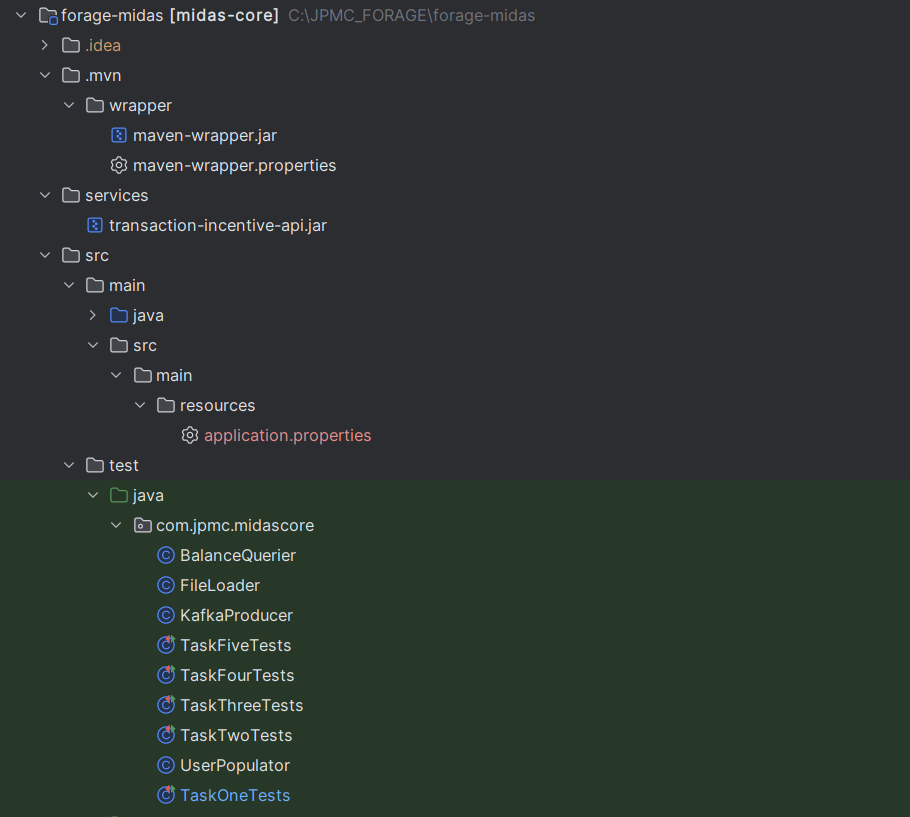

# JPMorgan Chase Forage Job Simulation – Midas Core Backend

This repository contains the solution to the **JPMorgan Chase Software Engineering Virtual Experience Program** on Forage. The project simulates a core part of a banking system — the **Midas Core backend** — which processes and stores user financial transactions with real-time incentive logic via Kafka and external APIs.

---

## 💼 About the Project

The **Midas Core** system is a backend Spring Boot application that:
- Receives transaction messages via **Kafka**
- Applies incentives via an external incentive service
- Stores users and transactions in a **relational database**
- Exposes a REST API to check user balances

This simulation provides experience with real-world technologies used at JPMorgan Chase & Co., including microservices, messaging systems, automated testing, and external service integration.

---

## 🧰 Tech Stack

| Category         | Tools/Technologies                               |
|------------------|--------------------------------------------------|
| Language         | Java 17                                          |
| Framework        | Spring Boot                                      |
| Messaging        | Apache Kafka                                     |
| Testing          | JUnit, Spring Boot Test                          |
| Build Tool       | Maven                                            |
| External Service | `transaction-incentive-api.jar` (provided by JPMC) |
| DB/ORM           | H2 (In-Memory DB), JPA (Hibernate)               |
| JSON             | Jackson                                          |

---

## 📁 Project Structure


---

## ✅ Tasks Completed

- [x] **Kafka Consumer** to receive transactions
- [x] **User and Transaction** persistence with JPA
- [x] **Balance API** to expose user balances
- [x] **Incentive API Integration** with external service
- [x] **Automated Test Cases** for all components
- [x] **GitHub Repository Setup** with structured commits

---

## 🚀 How to Run

### 1. Clone the repository
```bash
git clone https://github.com/BHUVANESH-SSN/JPMorganChase-Forage-Job-Simulation.git
cd JPMorganChase-Forage-Job-Simulation
```

### 2.Start the incentive API (in separate terminal)

```bash java -jar transaction-incentive-api.jar ```

### 3.Run the Application 

```bash ./mvnw spring-boot:run ```

### 4. Run Tests

``` ./mvnw test```


## 🙋‍♂️ Author
 # Bhuvanesh S
## Pre-final year student at SSN College of Engineering
🔗 [LinkedIn](https://www.linkedin.com/in/bhuvanesh-cse) | 🌐 [GitHub](https://github.com/BHUVANESH-SSN)
